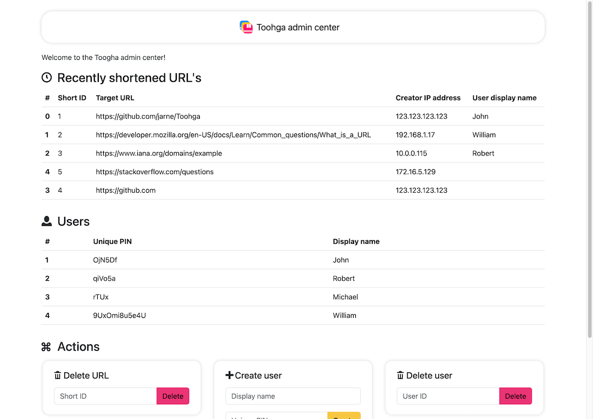

    

<h1 align="center">Toohga</h1>

The smart URL shortener

 

    
    
    

##

[• Description](#-description)  
[• Usage](#-usage)  
[• Contribution](#-contribution)  
[• License](#%EF%B8%8F-license)

## 📙 Description

Toohga is your smart private URL shortener with very short URL's.

### Screenshots

## 🖥 Usage

### Setup & requirements

The application needs a modern version of PHP, a MySQL database and a Redis server.

The following environment variables need to be set:

| Env variable     | Description                              |
| ---------------- | ---------------------------------------- |
| `MYSQL_HOST`     | Hostname of MySQL server                 |
| `MYSQL_USER`     | Database user                            |
| `MYSQL_PASSWORD` | Password of the database user            |
| `MYSQL_DATABASE` | Name of the MySQL database               |
| `REDIS_HOST`     | Hostname of the Redis server             |
| `ADMIN_KEY`      | Secure random secret for the admin panel |

Additionally, the following optional environment variables can be set:

| Env variable        | Description                                                                                  |
| ------------------- | -------------------------------------------------------------------------------------------- |
| `AUTH_REQUIRED`     | Requires a user authentication PIN when creating URL's (set to true/false, default to false) |
| `DELETE_AFTER_DAYS` | Delete URL's after x days (default is 14 days)                                               |
| `CONTACT_EMAIL`     | Display a contact e-mail address on the front page                                           |
| `PRIVACY_URL`       | Display a link to an external privacy page on the front page                                 |
| `ANALYTICS_SCRIPT`  | Embed HTML code for an analytics script                                                      |

## 🙋‍ Contribution

Contributions are always very welcome! It's completely equal if you're a beginner or a more experienced developer.

Thanks for your interest 🎉👍!

## 👨‍⚖️ License

[MIT](https://github.com/jarne/Toohga/blob/master/LICENSE)
