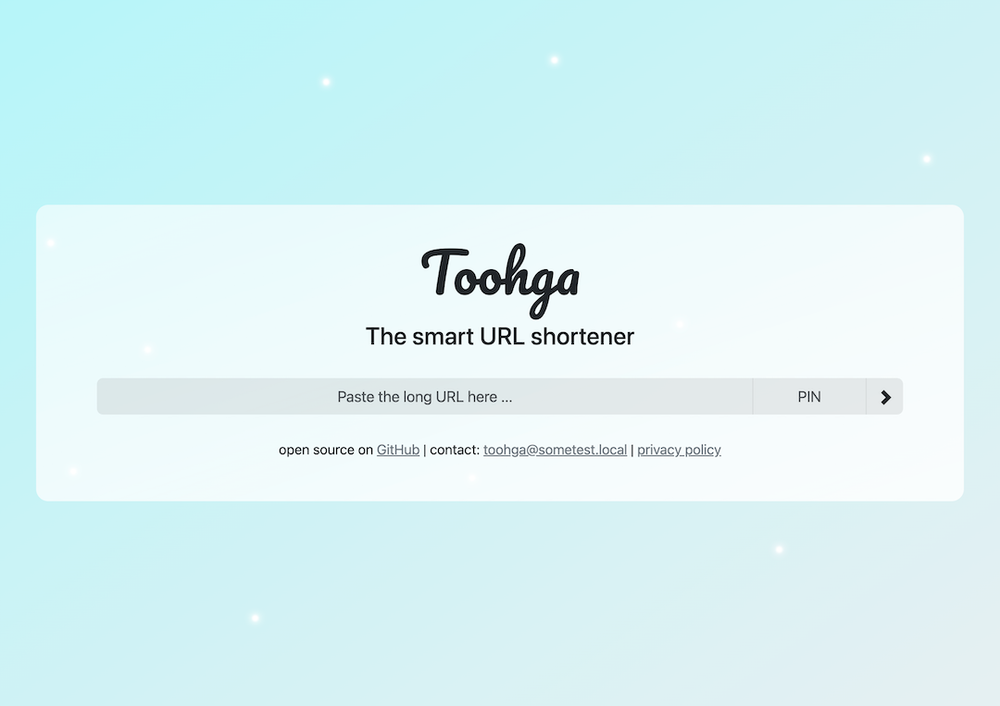

<p align="center">
    
</p>

<h1 align="center">Toohga</h1>
<p align="center">The smart URL shortener</p>

<p align="center">
    <a href="https://github.com/users/jarne/packages/container/package/toohga">
        
    </a>
    <a href="https://circleci.com/gh/jarne/Toohga">
        
    </a>
    <a href="https://github.com/jarne/Toohga/blob/master/LICENSE">
        
    </a>
</p>

## 📙 Description

Toohga is your smart private URL shortener with very short URL's.
It uses a custom algorithm to generate short codes that stay as short as possible, using combinations of numbers and letters.
The application can be operated both open to the public or secured by PIN codes required to create new URL's.
An admin panel provides features to perform administrative tasks, such as managing users and listing or deleting URL's.

### Screenshots




## 🖥 Usage

### Docker Compose

The recommended way to deploy Toohga is using Docker. There is a ready-to-use
example [Docker Compose file](./docker-compose.yml) available in this repository.

With [Docker installed](https://docs.docker.com/engine/install/), you can use the following
commands to clone the repository and run Toohga using Docker Compose.

First, clone the repository.

```sh
git clone https://github.com/jarne/Toohga.git
cd Toohga
```

Then copy the `.env` file template for Docker and replace the secret values in this file.

```sh
cp .env.docker.example .env
```

Start the services using Docker Compose.

```sh
sudo docker compose up
```

### Manual deployment

The application needs a modern version of PHP, a MySQL database and a Redis server.

Alternative deployment methos are to use the [Docker](./Dockerfile) image or deploy the
PHP application on a web server such as Apache HTTP (see the following [config file](./000-default.conf) for this).

When deploying without the Docker file, keep in mind to install required dependencies using Composer
and Yarn:

```
composer install

cd client
yarn install
yarn run build
```

### Environment variables

The following environment variables need to be set:

| Env variable     | Description                                                  |
| ---------------- | ------------------------------------------------------------ |
| `MYSQL_HOST`     | Hostname of MySQL server                                     |
| `MYSQL_USER`     | Database user                                                |
| `MYSQL_PASSWORD` | Password of the database user                                |
| `MYSQL_DATABASE` | Name of the MySQL database                                   |
| `REDIS_HOST`     | Hostname of the Redis server                                 |
| `ADMIN_KEY`      | Secure secret for accessing the admin panel                  |
| `JWT_SECRET`     | Randomly generated secret for encrypting admin access tokens |

Additionally, the following _optional_ environment variables can be set:

| Env variable             | Description                                                                                     |
| ------------------------ | ----------------------------------------------------------------------------------------------- |
| `TGA_AUTH_REQUIRED`      | Requires a user authentication PIN when creating URL's (set to true/false, default to false)    |
| `DELETE_AFTER_DAYS`      | Delete URL's after x days (default is 14 days)                                                  |
| `TGA_CONTACT_EMAIL`      | Display a contact e-mail address on the front page                                              |
| `TGA_THEME`              | Visual color theme of the application (possible values are: `pink`, `orange`, `blue` (default)) |
| `TGA_PRIVACY_URL`        | Display a link to an external privacy page on the front page                                    |
| `TGA_ANALYTICS_SCRIPT`   | Embed HTML code for an analytics script                                                         |
| `TGA_API_ENDPOINT`       | Specify general API endpoint for front-end to use                                               |
| `TGA_ADMIN_API_ENDPOINT` | Specify admin API endpoint for front-end                                                        |

> All environment variables beginning with `TGA_` are exposed to the front-end and therefore are publically accessible. They should not contain sensitive information!

## ⌨️ Development

Toohga is based on a back-end and front-end part.

### Back-end

The back-end inside the main folder is developed in PHP and uses the Slim framework. It stores its data in a MySQL
database and uses a Redis server for caching. Dependencies are managed using Composer.

A basic server for development can be launched as PHP web server inside the `public` folder,
with the `index.php` file as a router script (e.g. using `php -S 0.0.0.0:8080 -t . index.php`).

Unit tests inside the [tests](./tests) folder are based on the PHPUnit framework.
The following checks should be run before commiting code:

```sh
composer run test
composer run code-analyze
composer run check-format
composer run fix-format
```

### Front-end

The front-end inside the `client` folder is written in JavaScript and is based on Vue.js, Vite and Bootstrap for styles.

Run development server: `yarn run dev`
Create build: `yarn run build`
Format code style: `yarn run format`

## 🙋‍ Contribution

Contributions are always very welcome! It's completely equal if you're a beginner or a more experienced developer.

Thanks for your interest 🎉👍!

## 👨‍⚖️ License

[MIT](https://github.com/jarne/Toohga/blob/master/LICENSE)
